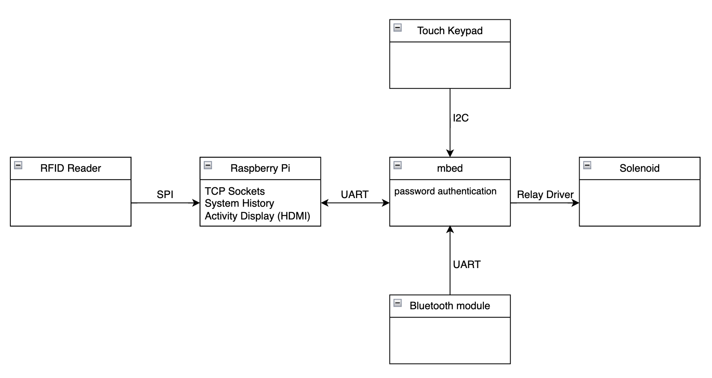
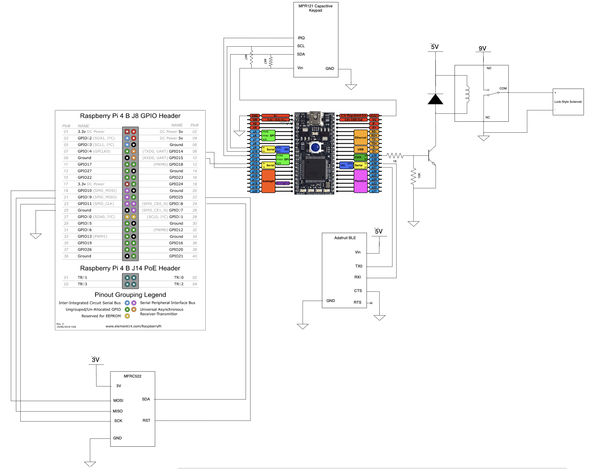

# Team Members
* Connor Talley (Section B)
* Jingsong Guo (Section B)
* Addison Elliott (Section A)
* Jackie Chen (Section A)


<!-- TABLE OF CONTENTS -->
<details>
  <summary>Table of Contents</summary>
  <ol>
    <li>
      <a href="#about-the-project">About The Project</a>
      <ul>
        <li><a href="#built-with">Built With</a></li>
      </ul>
    </li>
    <li>
      <a href="#getting-started">Getting Started</a>
      <ul>
        <li><a href="#prerequisites">Prerequisites</a></li>
        <li><a href="#installation">Installation</a></li>
      </ul>
    </li>
    <li><a href="#usage">Usage</a></li>
    <li><a href="#roadmap">Roadmap</a></li>
    <li><a href="#contributing">Contributing</a></li>
    <li><a href="#license">License</a></li>
    <li><a href="#contact">Contact</a></li>
    <li><a href="#acknowledgments">Acknowledgments</a></li>
  </ol>
</details>


<!-- ABOUT THE PROJECT -->
## About The Project


There are many great README templates available on GitHub; however, I didn't find one that really suited my needs so I created this enhanced one. I want to create a README template so amazing that it'll be the last one you ever need -- I think this is it.

Here's why:
* Your time should be focused on creating something amazing. A project that solves a problem and helps others
* You shouldn't be doing the same tasks over and over like creating a README from scratch
* You should implement DRY principles to the rest of your life :smile:

Of course, no one template will serve all projects since your needs may be different. So I'll be adding more in the near future. You may also suggest changes by forking this repo and creating a pull request or opening an issue. Thanks to all the people have contributed to expanding this template!

Use the `BLANK_README.md` to get started.

<p align="right">(<a href="#readme-top">back to top</a>)</p>


### Built With

* mbed LPC1768​
* Raspberry Pi (Zero W)​
* MFRC-522 RFID Reader​
* Bluefruit LE UART Friend​
* MPR121 Capacitive Touch Keypad​
* Adafruit 9V-12V Lock-Style Solenoid​
* 5V Relay​
* BJT​
* Diode​
* 1k Resistor​
* 10k Resistor​
* 2x 4k7 Resistor​
* 9V Power Supply​
* 5V Power Supply​
* Connecting Wires​

<p align="right">(<a href="#readme-top">back to top</a>)</p>


<!-- GETTING STARTED -->
## Getting Started
### Preparing Raspberry Pi

1. We first have to make changes to the Raspberry Pi configurations. By default, the SPI (Serial Peripheral Interface) is disabled, so open the raspi-config tool, using the following command.
```
sudo raspi-config
```
2. Use keyboard arrow keys to select **“5 Interfacing Options“** and press press Enter.
3. Use keyboard arrow keys to select **“P4 SPI“** and press Enter.
4. Select Yes with your arrow keys to enable the SPI Interface and press Enter.
5. Restart the Pi by getting back to the terminal by pressing Enter, then ESC, and the following command.
```
sudo reboot
```
6. Once rebooted, check if spi_bcm2835 is listed when following command is run.
```
lsmod | grep spi
```
   

### Installing Python and Libraries on Pi

1. Check if Pi is up to date.
```
sudo apt update
sudo apt upgrade
```
2. Install all required packages for RFID reader.
```
sudo apt install python3-dev python3-pip
```
3. Install the spidev Python library that handles interactions with the SPI. Note that sudo is used to ensure the package is installed so that all users can utilize it and not just the current user.
```
sudo pip3 install spidev
```
4. Install the MFRC522 library.
```
sudo pip3 install mfrc522
```

<p align="right">(<a href="#readme-top">back to top</a>)</p>


## Connections and Wiring



##Demonstration
A video demonstration can be found here: https://youtu.be/8DHuXTUlJBs
<!-- USAGE EXAMPLES -->
## Usage

Use this space to show useful examples of how a project can be used. Additional screenshots, code examples and demos work well in this space. You may also link to more resources.

_For more examples, please refer to the [Documentation](https://example.com)_

<p align="right">(<a href="#readme-top">back to top</a>)</p>

